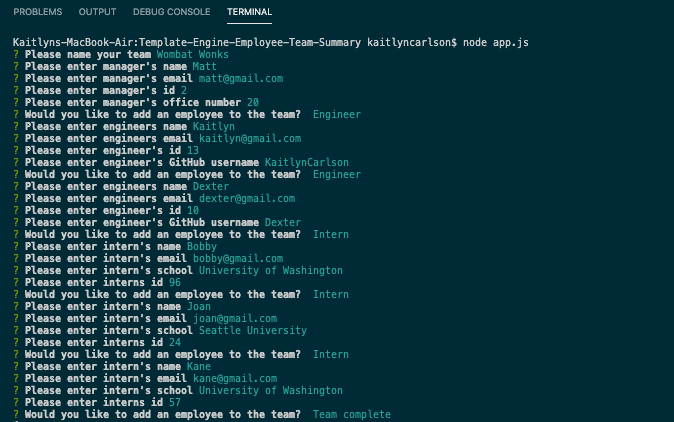
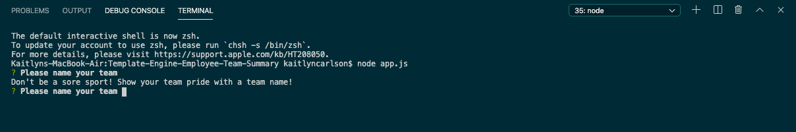
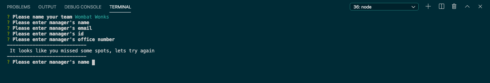
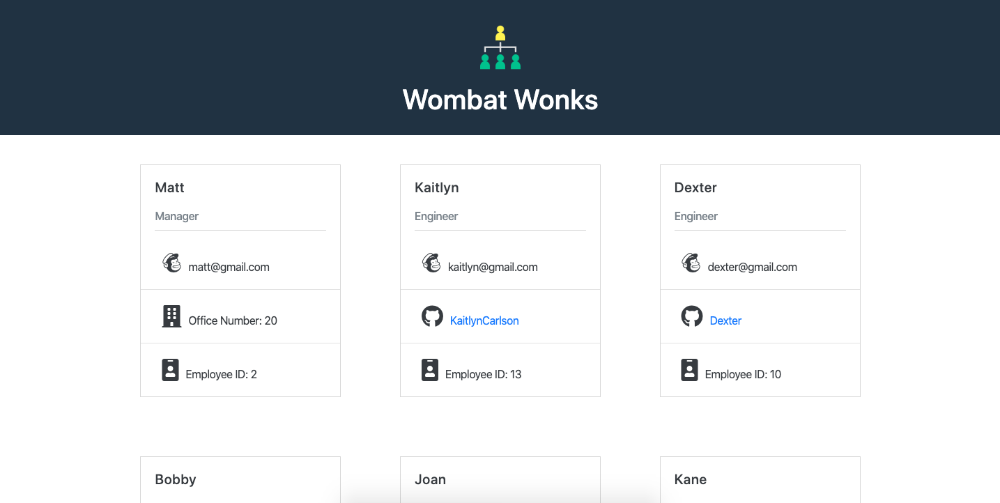

# Template-Engine-Employee-Team-Summary

A command line application that generates software engineering team profiles.

## Purpose

The purpose of TEETS is to create an efficient method for users to generate team profiles that contain relevant data and references for engineering team members. Although targeted at engineers, this application can certainly be relevant to a myriad of edge case users.

## User Story

```
As a manager
I want to generate a webpage that displays my team's basic info
so that I have quick access to emails and GitHub profiles
```

## Functionality

1. Clone repository, navigate to repository in terminal (or console).

**Run from Command line**

```
$ npm i             // Install the module dependencies
$ npm app.js        // Run the application
```

2. Node package inquirer is utilized to prompt the user through a series of questions to gather the necessary data for building `'theTeam'`. Each member of the team instantiates their relevant class (class hierarchy can be found in file `/lib`). The HTML file is rendered with fs as the user inputs the information, and applies the appropriate template to the rendered employee.

**Inquirer Prompts:**

> Team Name

> Manager name, email, office number, and id.

> Add Employee (Engineer, Intern)

> Engineer name, email, id, and github username

> Intern name, email, id and school

**Example Input Session**



**Class Hierarchy Testing**

3. Node package jest is used in order to run tests on the class hierarchy to ensure proper functionality of both class values and methods.

**Validation**

4. During the CLI team building interaction, user responses are validated for an input. If the user enters an empty input field they are alerted, and prompted appropriately to ensure each question receives an answer.




## Rendering team page locally as `team.html`


